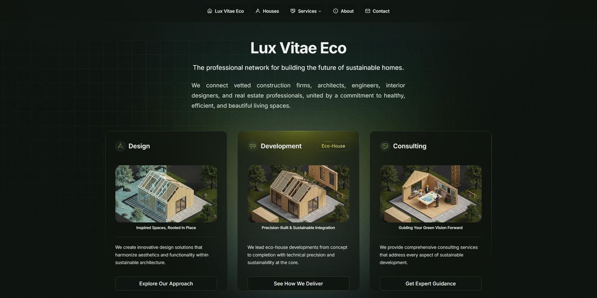

# Lux Vitae - Eco House

## The Foundation of Sustainable Architecture

An ecological home is more than a structure — it’s an integrated system designed to perform in harmony with its environment. Lux Vitae eco-homes fuse innovative technology with timeless design to dramatically reduce energy use, eliminate waste, and nurture healthier, more resilient living spaces. This is more than architecture — it’s a necessary evolution in how we build, live, and belong to nature.

## Development

LVE custom Next.js with minimal UI components, built with shadcn/ui and Tailwind CSS,  
designed to a responsive, and user-friendly web site.



## Features

- **Responsive Design**: Responsive design with Tailwind CSS
- **TypeScript Support**: TypeScript support
- **Next.js**: Latest Next.js features including App Router
- **Clean Architecture**: organized component structure
- **Vercel Ready**: Optimized for deployment on Vercel
- **Shadcn/ui**: A library for React
- **radix-ui**: A library for React
- **EmailJS**: EmailJS for sending emails

## Stack

This starter kit is built with:

- **Framework:** [Next.js](https://nextjs.org/)
- **Component library:** [shadcn/ui](https://ui.shadcn.com/)
- **CSS framework:** [Tailwind CSS](https://tailwindcss.com/)
- **TypeScript:** TypeScript support
- **UI Icons:** [Lucide React](https://lucide.dev/)
- **Deployment:** [Vercel](https://vercel.com/)

## Prerequisites

### Local dev environment

- [Node.js](https://nodejs.org/en/download/package-manager/current) version > `22`
- [npm](https://www.npmjs.com/), [Yarn](https://yarnpkg.com/), or [pnpm](https://pnpm.io/)

### Accounts

- [Vercel account](https://vercel.com/) (for deployment)

## Quick Start

### 1. Deploy on Vercel

#### Start deploy

Click this button to clone this repo and create a new eco-house project in your Vercel account:

[](https://vercel.com/new/clone?repository-url=https%3A%2F%2Fgithub.com%2Fusername%2Feco-house)

You can also [create a new application manually](https://vercel.com/new).

#### Deploy

Click **Deploy** when you're done. Wait for Vercel to build.

### 2. Local Development

#### Clone locally

1. Clone the repository you created earlier.

   ```sh
   git clone https://github.com/username/eco-house
   ```

2. Install dependencies using npm, Yarn, or pnpm.

   Install using npm:

   ```sh
   npm install
   ```

   Install using Yarn:

   ```sh
   yarn install
   ```

   Install using pnpm:

   ```sh
   pnpm install
   ```

3. Start the development server:

   ```sh
   npm run dev
   # or
   yarn dev
   # or
   pnpm dev
   ```

4. Open [http://localhost:3000](http://localhost:3000) with your browser to see the result.

## Project Structure

```
eco-house/
├── src/
│   ├── app/                 # Next.js App Router pages
│   │   ├── layout.tsx       # Root layout
│   │   └── page.tsx         # Home page
│   ├── components/          # React components
│   │   ├── home/           # Home page components
│   │   │   ├── header/     # Header components
│   │   │   ├── hero-section/ # Hero section
│   │   │   └── footer/     # Footer components
│   │   ├── gradients/      # Gradient background components
│   │   ├── shared/         # Shared utility components
│   │   └── ui/            # shadcn/ui components
│   ├── lib/               # Utility libraries
│   ├── styles/            # Global styles and CSS
│   └── hooks/             # Custom React hooks
├── public/                # Static assets
└── ...
```

## Customization

### Styling

- **Tailwind CSS**: Modify `tailwind.config.js` for custom design tokens
- **Global Styles**: Edit `src/styles/globals.css` for global styling
- **Components**: All UI components are in `src/components/ui/` and can be customized

### Components

- **Header**: Customize the navigation in `src/components/home/header/`
- **Hero Section**: Edit the main hero section in `src/components/home/hero-section/`
- **Footer**: Modify the footer in `src/components/home/footer/`

### Adding New Components

Using the shadcn/ui CLI to add new components:

```sh
npx shadcn-ui@latest add button
npx shadcn-ui@latest add card
npx shadcn-ui@latest add dialog
```

## Deployment

The easiest way to deploy your Next.js app is to use the [Vercel Platform](https://vercel.com) from the creators of Next.js.

Check out the [Next.js deployment documentation](https://nextjs.org/docs/deployment) for more details.

## Scripts

- `npm run dev` - Start development server
- `npm run build` - Build for production
- `npm run start` - Start production server
- `npm run lint` - Run ESLint
- `npm run lint:fix` - Fix ESLint issues
- `npm run prettier` - Format code with Prettier
- `npm run prettier:check` - Check code formatting

## License

This project is open source and available under the [MIT License](LICENSE).
